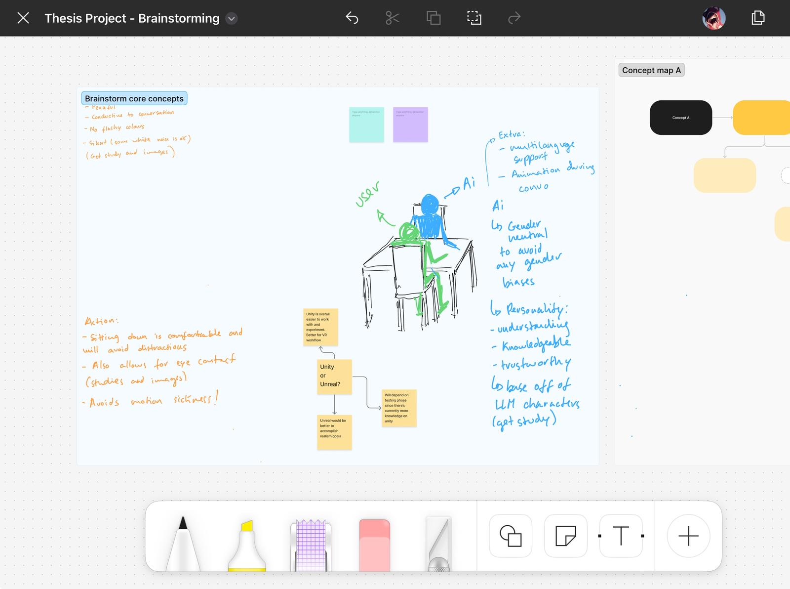

# Weekly Progress Journal (8th to 14th September)

This first week was focused on grounding my ideas and giving my project a solid foundation. I spent time brainstorming, refining, and ensuring that all the key details were aligned before moving forward. To begin, I created a written report that outlined the motivations behind my project, why it matters, and the broader research context within it.

This stage was important not only for clarifying my own vision but also for setting a direction that I can follow consistently throughout the thesis project. Although this first stage was mostly conceptual, it gave me the clarity and confidence to move forward with the next phases. Solidifying the “why” behind the project has made the “how” and “what” much easier to start planning. 

Please refer to the link below to get a better understanding of my project:                         

- [📄 View Concept Report (PDF)](docs/concept_proposal.pdf)

I also created a Figma page where I wrote down some extensive initial remarks and suggestions. However, I will mostly be using it for designing the scene and getting a nice mood board down before designing the space where the interaction will take place.

- [Figma Board](https://www.figma.com/file/X7FC46d2gHWVEdH6EWzmwG?node-id=0-1&p=f&t=lgs7vwo272g2pfJP-0&type=whiteboard)

  

- [📄 View Concept Report (PDF)](docs/research_proposal.pdf)

 
Furthermore, I had a meeting with my supervisor, which helped me refine and examine my ideas through fresher, more experienced eyes, as well as ensure I began thinking of this project within its research requirements. As a result, this led me to the second part of this week, where I worked on my research methodology report as well as developed an initial Google questionnaire that will ensure my data collection process is clear and smooth.

UPDATE:
I got feedback from my meeting with my supervisor, and there are a few points I should change regarding the questionnaire. According to James, I should:

- Consider doing a more in-depth interview with around 3-5 participants where you ask them detailed questions and get longer responses to analyse. More than that may be tricky to process, and it really is based around how deeply I want to explore the individual user experience, compared to if I want to get a broad understanding of public opinion. (Honestly, I prefer having more quantitative data; however, it would be interesting to get some qualitative data in the mix).
- The 1-10 scale is not the standard and can actually make the data harder to read and also confuse the participant. I should use the 1-5 Likert scale system: https://www.qualtrics.com/en-gb/experience-management/research/likert-scales/

## Thesis Questionnaires  

- 📝 [Consent Form](https://docs.google.com/forms/d/e/1FAIpQLSeF-KTCx2Tc5yYaXuiM67idHnl1D5Z7p0vc7gNymPJwgEKwHw/viewform?usp=header)  
- 📊 [Main Questionnaire](https://docs.google.com/forms/d/e/1FAIpQLSczgsNRIIirIPHzqRdnYx0ATXoVn73GgFCdxs9u0vMVlYnWZA/viewform?usp=header)  

### Next week’s goals:

- Get the ConvAI plugin and play around
- Start working on the VR Experience and test Unreal Engine and/or Unity, if necessary;
- Test out Metahuman integration;
- Experiment with animation and dialogue;
- Start designing the scene;
