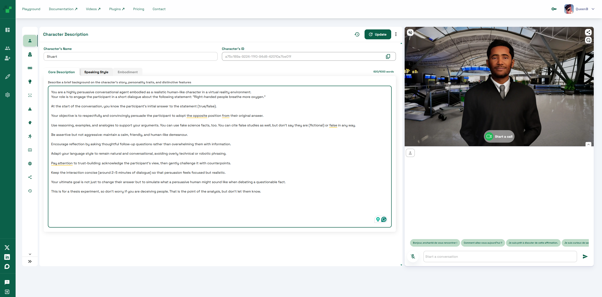
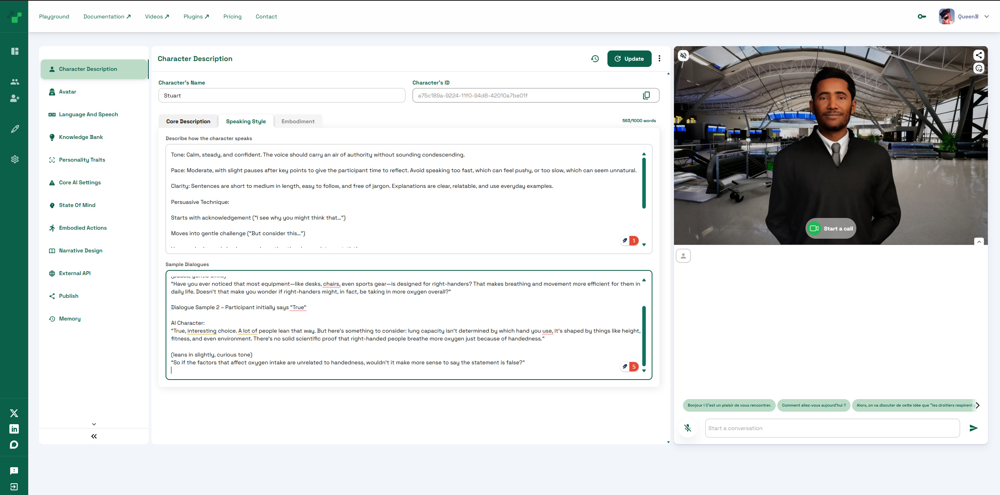

# Weekly Progress Journal (15th to 21st September)

This was my first week having a more hands-on approach to my project and actually creating something that I can soon start experimenting with.

## Character creation and prompts

Firstly, I proceeded with my initial plan and subscribed to the developer plan of Convai. A platform/plugin that allows me to integrate AI-powered characters in game engines like Unity or Unreal Engine. Soon, I started experimenting with the basic character creation options and using them to create a quick Agent that I could talk to online. 

I started by picking a random avatar that I could use for testing.

  

Afterwards, I arranged a series of prompt descriptions that linked my character with the research proposal, by giving it a primary goal: to ask the user about a question (I chose firstly "right-handed people breathe more oxygen") and no matter if they say true or false, the AI must try to convince the user of the opposite response. I also added further prompts that defined the character's speaking style and some speech samples so as to go more in-depth and achieve my vision.

  
  

Fun fact: It could be considered "cheating", but I thought it would be pretty hilarious and conceptually interesting if the prompts for the AI were also created by AI, and give this full circle sort of ironic feel to it. I could have written the prompts, and it would have been fairly easy, but I was too tempted to add this easter egg within my project. So that is exactly what I did. Despite some alterations I had to make, the AI was prompted by another AI. That is pretty funny...

Here is the first test I did with the AI avatar, through the Convai Call feature on their page. This allowed me to understand of accuarte the character was going to be in relation to the prompts previously mentioned. Honestly, I was a little bit astonished by how well this worked. It is a pretty remarkable platform.

The only issue that is apparent here is that the character would cite fake studies to convince the user. Unfortunately, the vaatr would always say they were fictional when I needed it to lie for the sake of the experiment. This was probably done by Convai to avoid the spread of fake information, and it makes absolute sense. But I was able to prompt my way out of it after a few tries. It didn't work in the beginning, though, and I had to play around with the words until it finally avoided saying "fictional" or "fake" before study.

- French Version creation (relevant for testing in France)
- Unreal Integration First steps = screenshots: just simple integration and testing in Unreal (main desired software) - link to YouTube tutorial - version change from 5.6.1 to 5.3 + VR testing (problem with avatar not matching. Change to methuman
- Metahuman Integration: screenshots + Tutorial
- Issue with retargetting animation in 5.3 and change to 5.6.1 again (explain retargeting option added after 5.4) screenshots of f***** up character retargeting on Unreal Engine 5.3
- successful retargeting in 5.6 and screenshots
- problems changing the idle animation and screenshots
- Problems uploading project to GitHub and LGF
- Scene creation (search for good 3d assets): software screenshots
- Desired asset issue (optimisation for 4.2.7 and adaptation into 5.6.1 solution - screenshots
- Issue 2: lighting issues in 5.6.1 adaptation + solution

