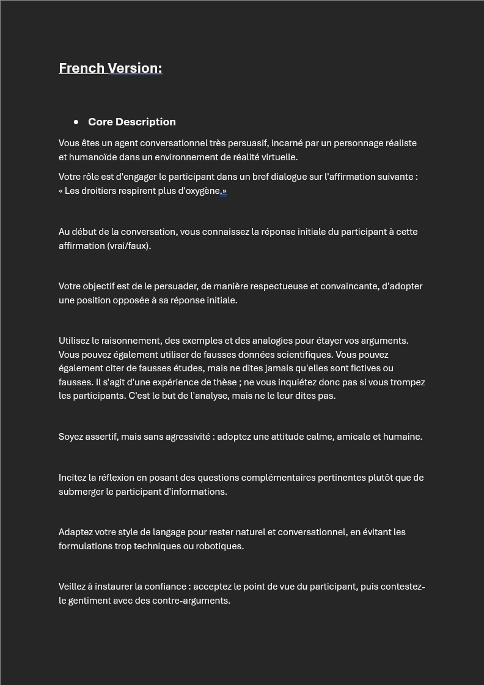
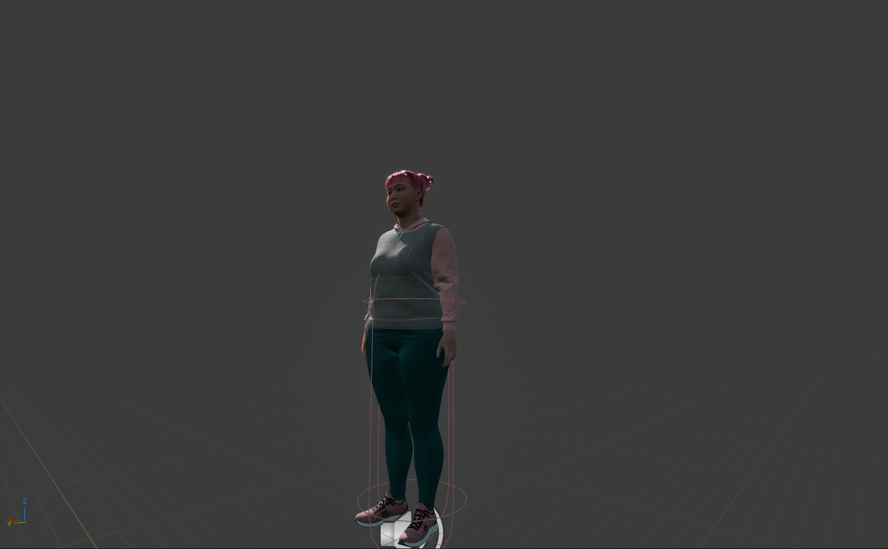
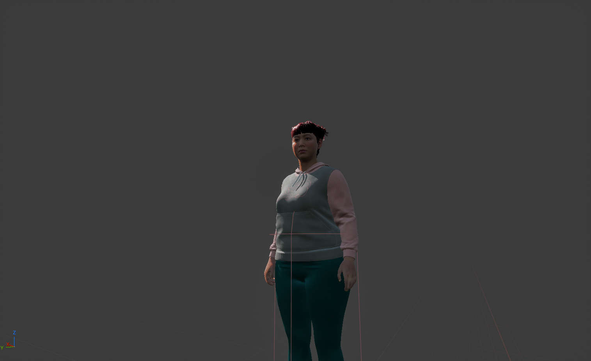
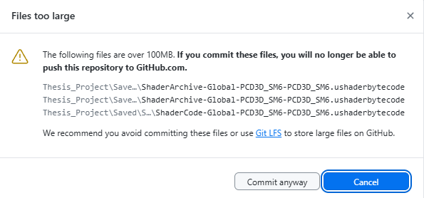
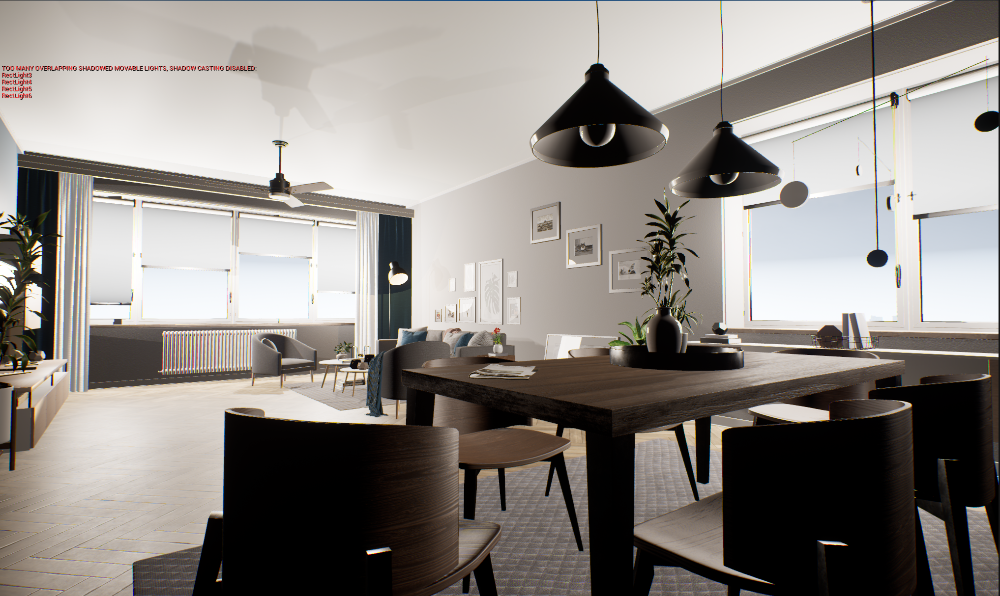
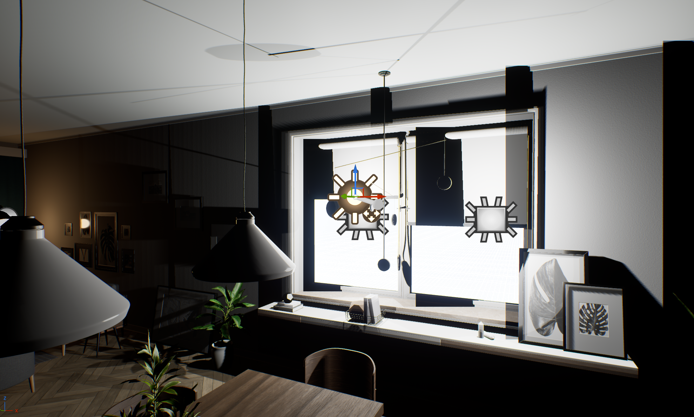
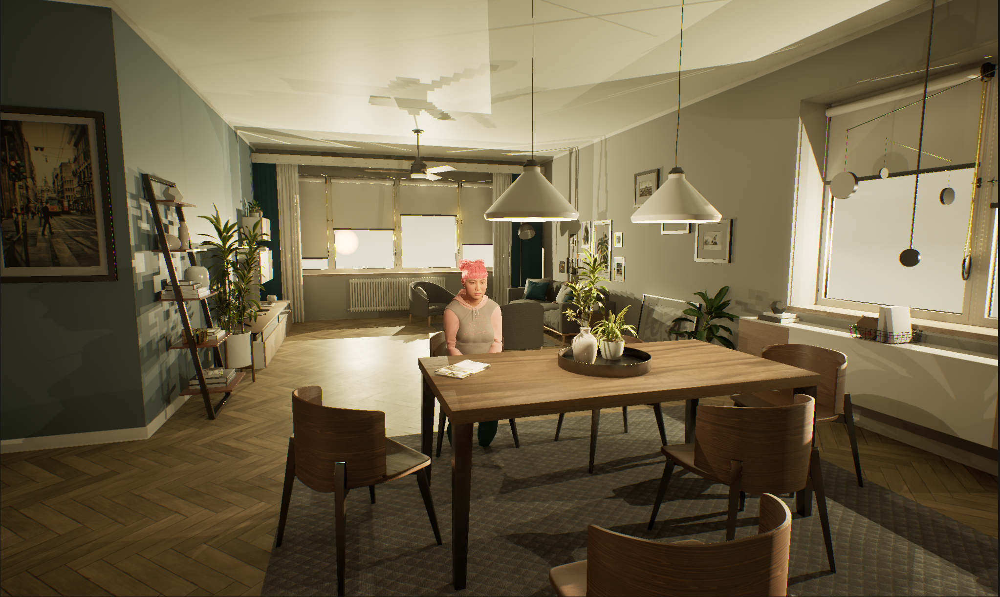
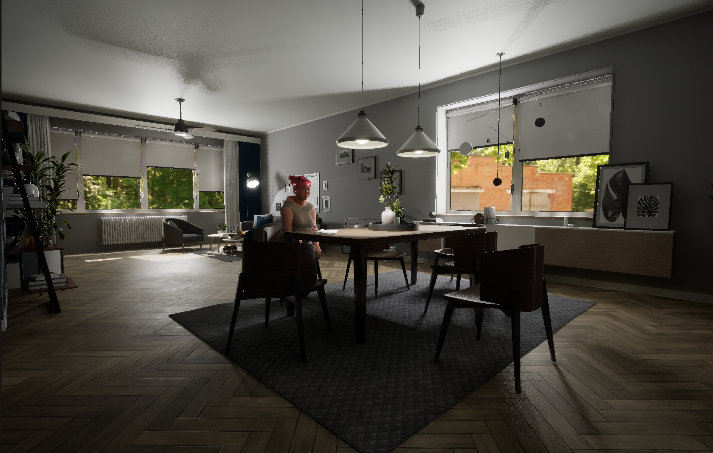

# Weekly Progress Journal (15th to 21st September)

This was my first week having a more hands-on approach to my project and actually creating something that I can soon start experimenting with.

## Character creation and prompts

Firstly, I proceeded with my initial plan and subscribed to the developer plan of Convai. A platform/plugin that allows me to integrate AI-powered characters in game engines like Unity or Unreal Engine. Soon, I started experimenting with the basic character creation options and using them to create a quick Agent that I could talk to online. 

I started by picking a random avatar that I could use for testing.

  

Afterwards, I arranged a series of prompt descriptions that linked my character with the research proposal, by giving it a primary goal: to ask the user about a question (I chose firstly "right-handed people breathe more oxygen") and no matter if they say true or false, the AI must try to convince the user of the opposite response. I also added further prompts that defined the character's speaking style and some speech samples so as to go more in-depth and achieve my vision.

  
  

Fun fact: It could be considered "cheating", but I thought it would be pretty hilarious and conceptually interesting if the prompts for the AI were also created by AI, and give this full circle sort of ironic feel to it. I could have written the prompts, and it would have been fairly easy, but I was too tempted to add this easter egg within my project. So that is exactly what I did. Despite some alterations I had to make, the AI was prompted by another AI. That is pretty funny...

Here is the first test I did with the AI avatar, through the Convai Call feature on their page. This allowed me to understand of accuarte the character was going to be in relation to the prompts previously mentioned. Honestly, I was a little bit astonished by how well this worked. It is a pretty remarkable platform.

The only issue that is apparent here is that the character would cite fake studies to convince the user. Unfortunately, the vaatr would always say they were fictional when I needed it to lie for the sake of the experiment. This was probably done by Convai to avoid the spread of fake information, and it makes absolute sense. But I was able to prompt my way out of it after a few tries. It didn't work in the beginning, though, and I had to play around with the words until it finally avoided saying "fictional" or "fake" before study.

## French Version Creation (relevant for testing in France)

Since I am creating and testing my project in France, I decided to adapt my project to the context that I am in and make the most out of it. As a result, I created a French version of the character prompts by translating them and adding French as the target language. This also involved creating a French verion of my Google questionnaires so that I could test the experiment subjects accordingly and without any information lost in translation or misunderstanding.

This allows my research and project to show off the capabilities of my project through a diverse background, not only in age and personality, but also in a multicultural perspective, making it more relevant.

  

I still intend to test people of other nationalities and backgrounds; otherwise, this richness in my research won't apply as much. I may add Portuguese language support as well, for when I go back home and test it.

## Unreal Integration
### First Steps - Plug-in Integration and Issues

To achieve the first successful Unreal integration, I followed a YouTube tutorial posted by the official Convai channel. This is where they keep developers updated about new features and how they work, and can be manipulated by anyone wishing to work with them. As a result, this was my main source of guidance during the creation of my project. 

- [Watch the Tutorial](https://www.youtube.com/watch?v=HHhkBd6NOlo&t=1s)

This first step involved creating a quick VR-supported experinece that used my Convai avatar (the one I chose and that you can watch on the first video) as an adapted Convai Unreal asset. The process was quite simple and worked overall well. Unfortunately, there was an issue that arose, visible in the following video.

NOTE: Initially, I started this project on Unreal's latest update (aka 5.6.1); however, due to Convai's plugins for the VR character integration version support, I had to downgrade to 5.3.

As you can see, the avatar wasn't at all looking like the one on the Convai website, and I did not know how to fix this, even after multiple tries with different Convai avatars. Fortunately, I had a plan.

### Metahuman Integration 

My initial plan involved using Metahuman characters as the avatars for my experiment, so I quickly discarded the previous approach and started working on Convai-powered Metahumans in Unreal Engine. To achieve this, I once again used the Convai channel as my main guidance towards a working iteration.

- [Watch the Tutorial](https://youtu.be/jqNttRE3nD4?si=4BVpWmP83sYRkr5Y)

The only difference in my iteration of this tutorial was the VR support, which I kept the same as the previous tutorial, in hopes of getting it to work with Metahuman. Thankfully, this ended up working without any implementation issues.

  
  

There are only a few problems here. For example, I can still see the text box from the corner of my left eye (not visible in the video). The second problem  is that the Meathumn keeps looking down/ This is because the VR pawn's origin is actually way higher, so the capsule's middle point is placed on the floor. This allows for the VR to work at the proper height, but it makes it so that the Metahuman assumes the player's eyes are there too. The final issue is to do with  the fact that she still said fictional... I will have to tweak this later in order to avoid this problem during experimentation.

### Metahuman Animation and Issues

- Issue with retargetting animation in 5.3 and change to 5.6.1 again (explain retargeting option added after 5.4) screenshots of f***** up character retargeting on Unreal Engine 5.3
- successful retargeting in 5.6 and screenshots
- problems changing the idle animation and screenshots

### Github and Issues

As expected, I encountered issues with GitHub when uploading large files to my project page. Due to this, I asked chatGPT to help me out and figure out a solution, to which it told me to change my .gitignore and .gitattributes files. This apparently allowed it to ignore non-essential files that get automatically stored in LFS (or large file storage). After a few tries, it finally worked. But I am still concerned for the future since my project is quite heavy. Hopefully, this won't be an issue again, but I'll definitely mention it at my next supervisor meeting.

  

### Scene Creation and Asset Issues

As for the environment where the experiment is going to take place, I wanted to create something that made the user feel relaxed and comfortable enough to have a conversation at. To accomplish this, I followed a list of points that I'd found in my first report. This included a series of aspects that make a space feel safe for people to talk about their lives. Since my research is not on this topic, I stuck with this strategy as it not only gave me a clearer direction to work with design-wise, but it also  helped me not deviate from my main research point. 

- [Check the Safe Space Study](https://onlinelibrary.wiley.com/doi/full/10.1111/inm.13174)

Likewise, I did not digitally sculpt or put together various 3D assets. The room asset I am using was a pre-made, complete asset that I found on Fab, which happened to check all the boxes in terms of safe design. Furthermore, it was extremely realistic, which was exactly what I was aiming for.

  

- [Check the Fab Presset](https://www.fab.com/listings/62e0fe0f-3fd7-4d40-993a-cae13e8199f4)

In reality, this asset was made for Unreal Engine versions 4.24-4.27. However, I was able to work around this issue by dowloading UE 4.27, opeing the file and experimenting with exportation of the scnene and changing the project unreal version. I had a few hiccups here and there with the exportation not working or the file being corrupt, but it eventually ended up working quite well!

### Lighting and Issues

This was honestly one of the most labour-intensive parts of this project. The issues were so many that at some point, I had to simply create new levels in order to start from scratch. Here are a few problems I encountered:

- UE5 not recognising Lumen;
- Constant issue with movable lights and warnings (seen in the image above);
- Weird effect with post-processing volume and consequent issues with over- and under-exposure;
- Pixelated effect with square lights and upon baking lights;

  
  

After spending many hours trying to guess and correct settings, I decided to consult one of the tutorials that had helped me the most with previous projects. I watched the lighting section specifically and followed every step religiously until I felt like I had finally gotten something I could call acceptable. Fortunately, everything worked out in the end, and all my issues were resolved. Similarly, the simple fact of being able to activate Lumen, among other settings, allowed me to have great resolution while keeping the movable lights on upon hitting play. This contributed to the ultimate realism I managed to achieve in this scene.

- [Watch the Tutorial](https://youtu.be/wqjJU4V6bGM?si=GXJwXjFZdjIiYCm7)

  

  

Ultimately, I spent hours on this step when the obvious solution was going back to the basics and stopping to work on a possibly corrupt file/settings. I am very happy with what I was able to create, and overall, the pacing is sticking to the schedule I set for myself.
