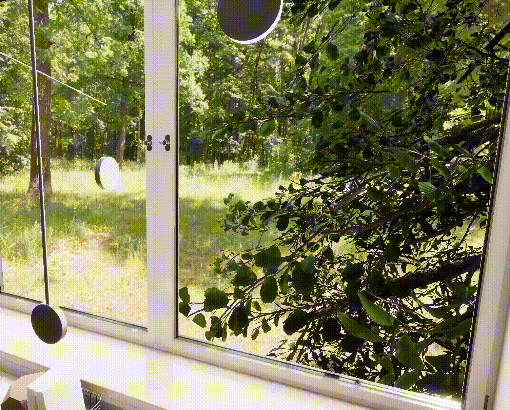
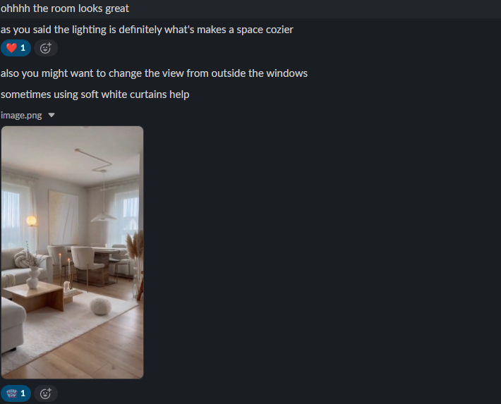
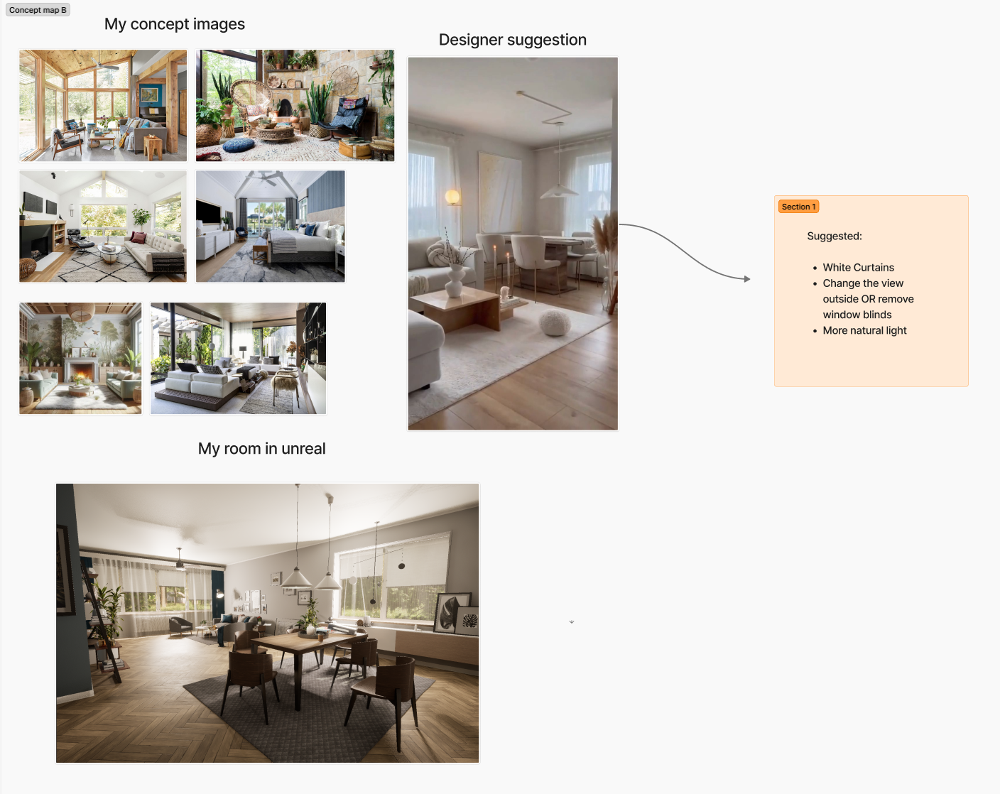
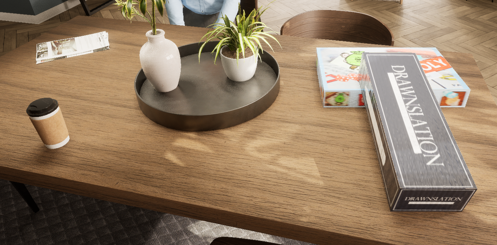
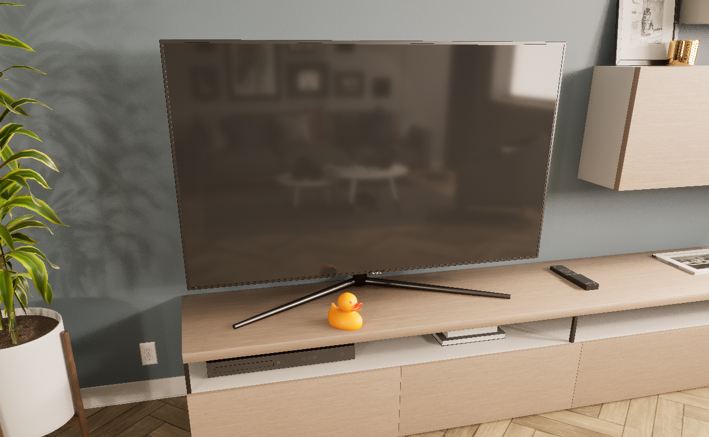
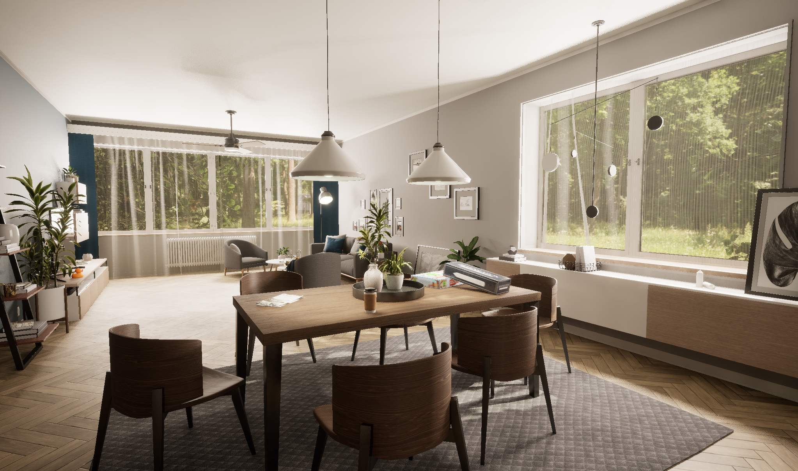

# Weekly Progress Journal (22nd to 28th September)

## Changes to questionnaire 

After my meeting with James, I decided to remove a few questions from my questionnaire, more specifically, the ones that asked the users for more in-depth written paragraphs. Upon further analysis, my supervisor helped me realise that this could quickly become quite difficult to process data-wise and that multiple-choice questions would be more relevant. I could then interview 2 or 3 people later on if I so desired.
Furthermore, he directed me towards the Likert scale system, which is the standard for these types of questions and ultimately made the choices easier to understand and more concrete for further analysis.

- [Link provided by my supervisor](https://www.qualtrics.com/en-gb/experience-management/research/likert-scales/)

## Giving Character Creator a go

## Sky Sphere and nature assets + issues

For the room window's background, I'd planned to have a more natural environment that coincided with my research on relaxing and safe spaces. To accomplish this in Unreal, I'd have two options. 1 - Create an environment from scratch with many heavy 3D realistic assets. Or 2 - Create a sky sphere with 8K nature pictures and add a few 3D assets close to the windows for further immersion. Well, I obviously chose the latter as it would not only make for an easier-to-run project, but it would also cut down on the time I'd have to work on it.

Unfortunately, despite everything else working, the sky sphere proved to be my last frustrating challenge with Unreal Engine. It was not the first time I created one, but unfortunately, depending on the software version and its various templates, the methods for creating a functional sky sphere can change. For some reason, it kept being upside down, and the scale was very peculiar. However, after hours of searching for solutions, giving up and then searching again, I finally found a developer tutorial that worked. 

- [Watch the tutorial](https://www.youtube.com/watch?v=PWzGDdA4auc&list=PLXF4hsk8dDMH0cd0G-5o2H_Naooywp4qW&index=7)

On the other hand, in terms of 3D assets, my approach was quite simple. I'd previously worked with Unreal's megascan packages and know them to be very reliable and incredibly well designed. As such, I chose a tree megascan packlage I found to fit the background, and imported a few tree assets to my main project from a secondary file so as not to overload it with all the extra 3D assets. The results were honestly amazing with the tree foliage, even including some light wind animations that just make it look very natural. watch the following Gif:

## Environment changes according to feedback

In terms of feedback, I mainly went to 3 different sources. Firstly, the closest person that had a design-based background was my classmate Iman. Having had professional experience in the field, her opinion was incredibily valid to me, therefore, I went to her first. This was her feedback.

### Person 1 - Iman

  

Besides this, she gave me some inspiration images to get the environment and lighing right. With this, I created a quick brainstorming board on Figma. Moreover, she told me to remove the office curtains.

  

### Person 2 - My partner 
Secondly, I decided to ask my partner for advice since he is a person outside the art's field and I wanted an honest opinion that cam froma feelings-based point of view instead of aesthetic-based. Furthermore, I had to try to keep the project as secret from other people as possible so as to not ruin the potential for experimenting on specific subjects here in France. 

His feedback was: It needs to be more chotic or have some random stuff around. Otherwise it feels too modern and not natural enough.

This was indeed a really useful insight as I ended up gping tp my safe space study and cheeck tthe poijts people had mentioned. And it did include things like board games and hot bevaarges. So that is exactly what I did. I wipped up a couple of Fab assets and placed them on the table. Furthermore, I decide to add a little rubber duck in front of the TV since it added that funny element that just made it look like a relaxed livable space.

  
  

### Person 3 - My supervisor

I obviously neede a thumbs up from my supervisor before advancing any further, but honmestly there isn't much to say. It was just really positive/undersdtanding and it allowed me to move on to the the next desiging phase, the character.

This is what I ended up with:

  

## Character Design and Morality (chatGPT)

Up to now, I had been using a placeholder character I'd gotten from Metahuman, however, my goal was to design an entirely new character that had some conceptual relavance to it. After digging further into gender, age, appearnace and how it relates to credibility, I quickly realised that the reulsts were mixed and that I would not be able to fairly analyse and make desisions based on this data without creating an entirely new research project by itself. Upon frther discussions with my supervisor he agreed on this point and told me to go with either a reandom avatar or just put a rnadom white male (which by itself could say a lot I guess). But no. I don't think it should be up to me since I'll be biased wetaher I inted to or not and lack experinece and knowledge in other cultures to make a Metahuman that can be seen and intercultural.

Instead I found a better approach that would take any guilt and responsibility off my hands and that both I and my supervisor fount to be conceptually interesting and ironic. I decided to let ChatGOT do it. I prompted it to used all the information it had available to create the most trsutworthy human face, which would then become the design for my Metahuman. Through this, I avoided a series of ethical and moral problems by attributinhg this task to the most knowledgeable (I guess) LLM that will instead make those desisions for me. Wethare there are biases or not, it will then depedn on humanities data concerning this issue/ the programnation and data use in ChatGPT, and not on me.

Here is the conversation I had with ChatGPT and how I got to my final Metahuman design.

Furthernmore, for the same reasons, ChatGPT was also used to help me figure out the accent, voice pitch and name of the character.

## Character personality changes according to study and issues

