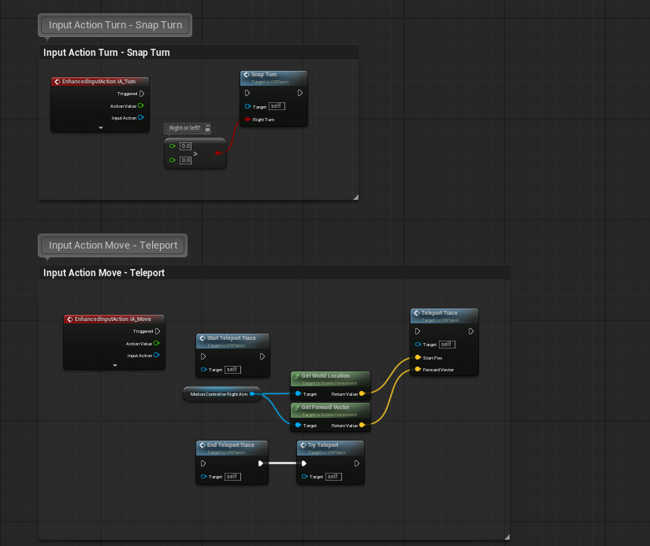
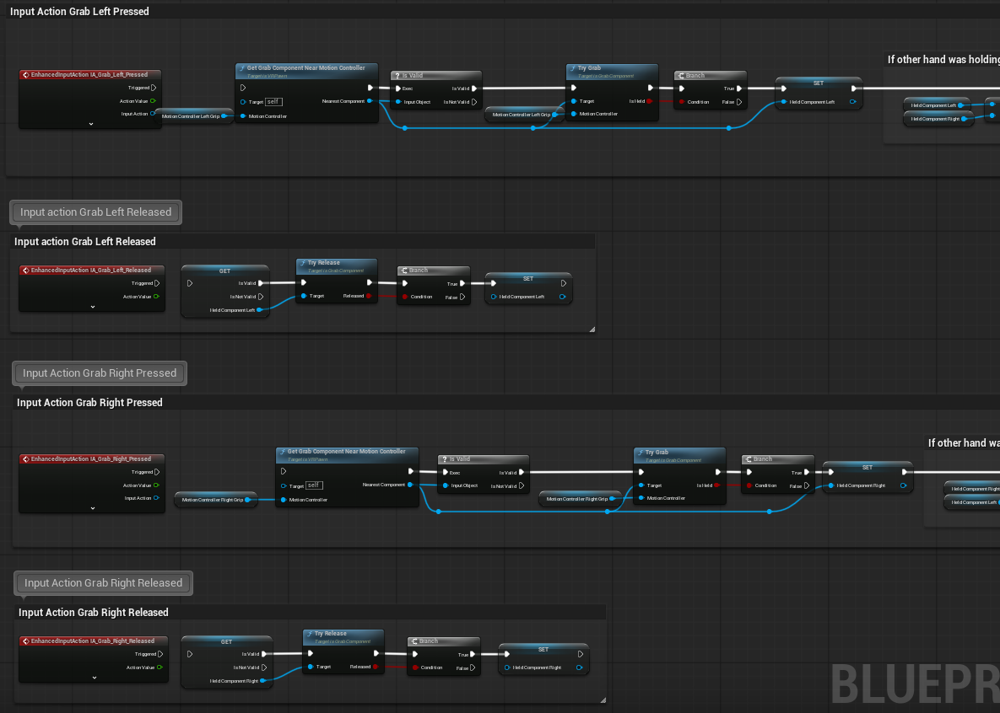
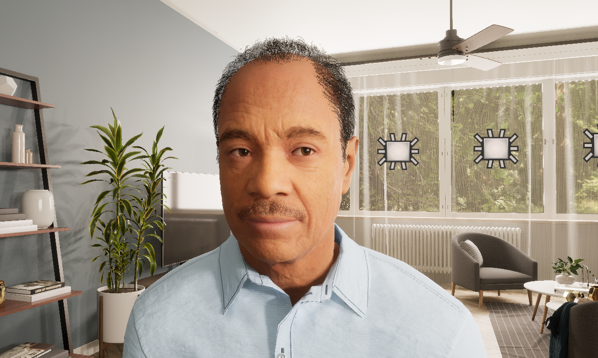
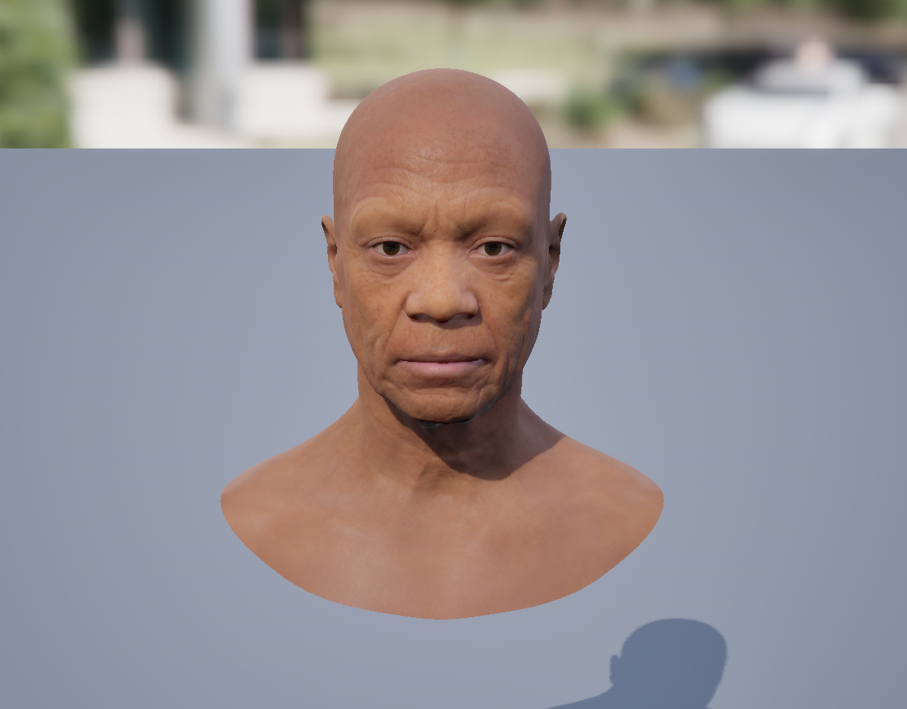
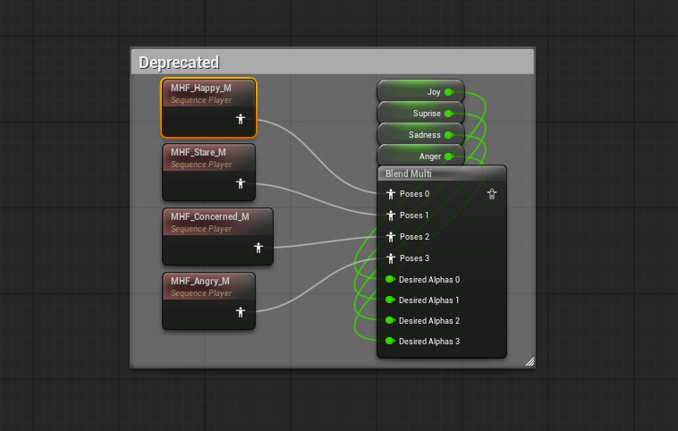

# Weekly Progress Journal (29th to 5th October)

## Last changes before testing

### Removing locomotion from VR blueprint 

The first step towards a finalised testable version of this project was to remove the locomotion and interaction system from the VR pawn to avoid any distractions or potential misclicks from the users. This was a very straightforward step, as it only involved disabling a few connections within the VR pawn blueprint.

  
  

### Character Smile

Secondly, according to the image on the previous progress journal and the explanation provided by ChatGPT, the character should be smiling in order to seem approachable and welcoming, as well as accepting and open to the user's opinions. To accomplish this, I simply went into the library of expressions provided by Metahuman and selected the one I wanted from within the character script.

  
  
  

### Testing

Finally, the only thing left was testing. However, this step was fulfilled throughout the making of this project, as it had been tested multiple times already. The final testing session was there to simply check and tune any final details and refine the prompts where necessary. The person who helped me the most with this step was my partner, as I could not simply send my project to other people, since it runs on my computer and has to be manipulated by me.

### User presentation script (English and French)

Upon checking all the boxes above, all that was left was creating an easy-to-follow script where I could guide each user through the explanation of the experiment, the questionnaires, instructions and goals. This would help me avoid any misunderstandings or ineffective testing sessions as well as make sure the users were always safe and aware of their rights. As a result, I created a version in English and one in French to cover as many people as I could, within my context.

- [📄 View English Script (PDF)](docs/English_Experiment_Script.pdf)
- [📄 View French Script (PDF)](docs/VOUS_Francais_Script_dexperimentation.pdf)

### Contacting and planning for experimentation
In general, this step was mostly accomplished by my partner since he's from France and would be able to connect me to people he knew, available for testing (family and friends). Of course, none of them knew the subject or contents of my thesis. Otherwise, they would not be acceptable candidates for testing.

On the other hand, I had to figure out a way to transport my entire workstation (PC tower, screen, camera, mouse, keyboard, VR headset and cables) everywhere I went for testing. Fortunately, I'd chosen a small enough tower that I was able to fit it in a suitcase and most other elements to bring it anywhere I needed to. Of course, it wasn't super practical or light, but to accomplish the goals proposed by my research question, it's the only way I'm able to collect data. Thankfully, my supervisor said 10 people would be enough, as he is also aware of the technical challenge that is moving my project around. 

