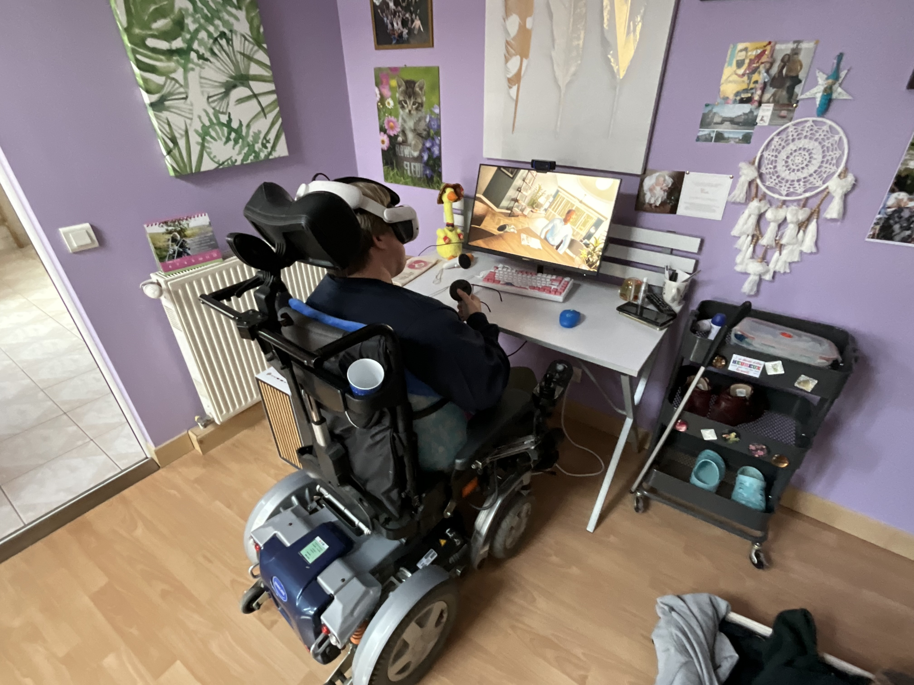
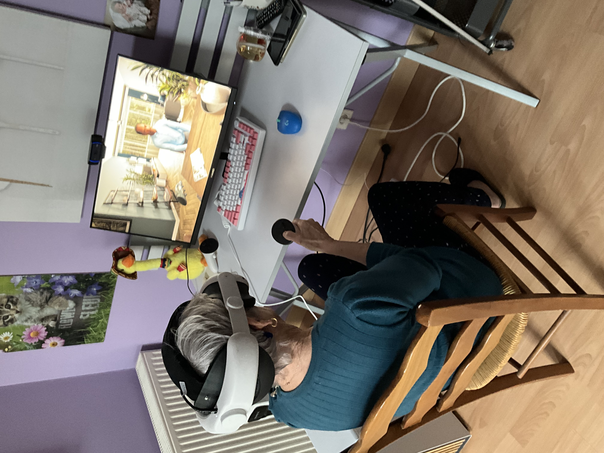
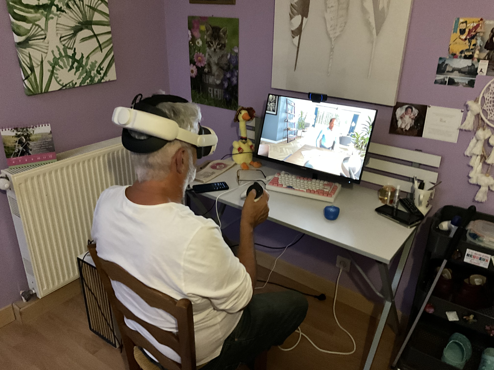
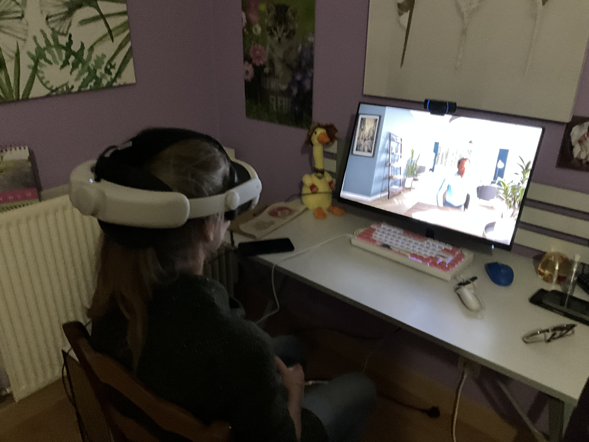
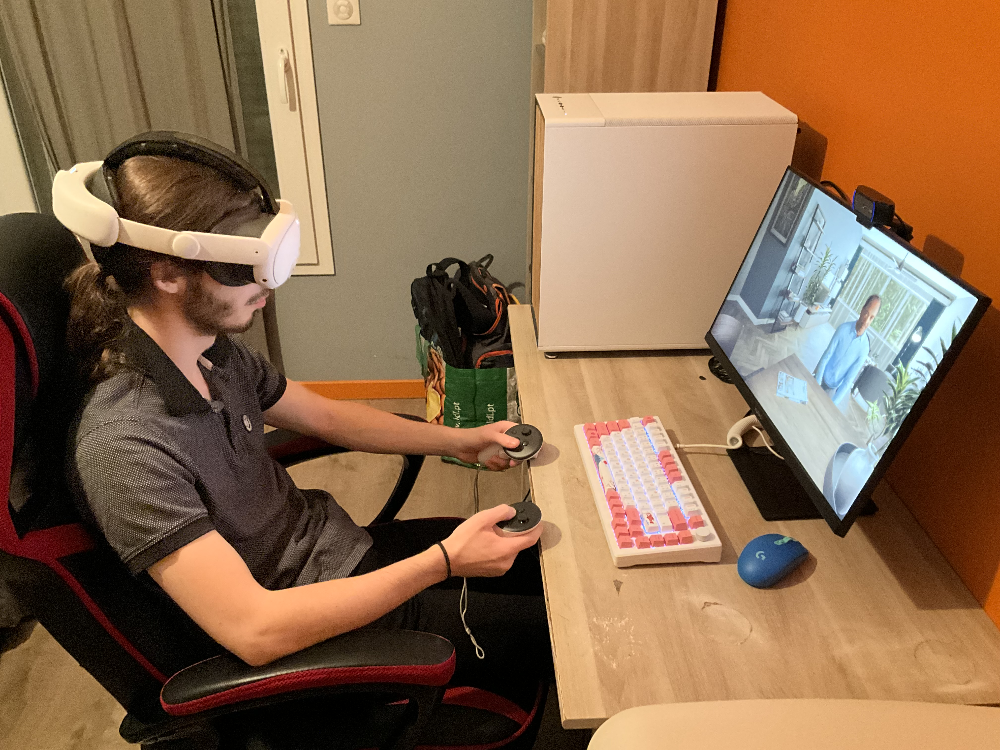
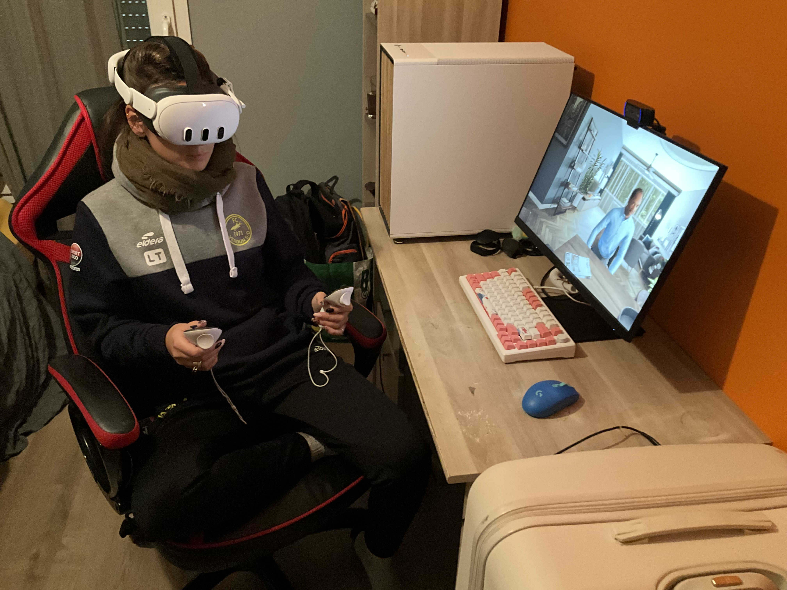
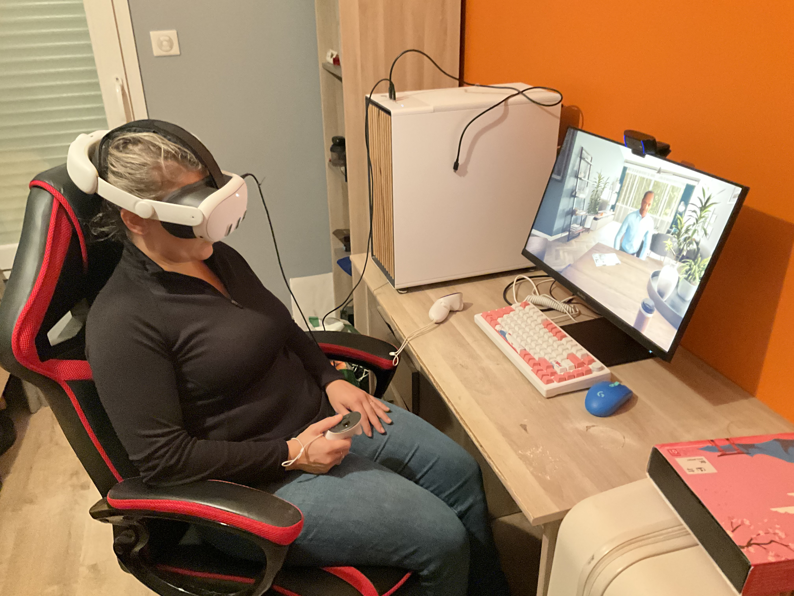
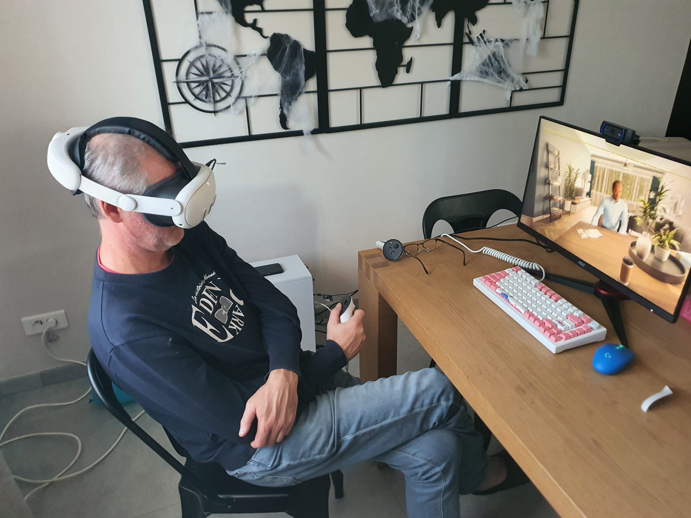
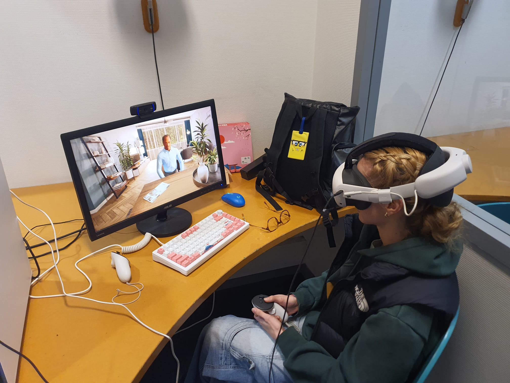
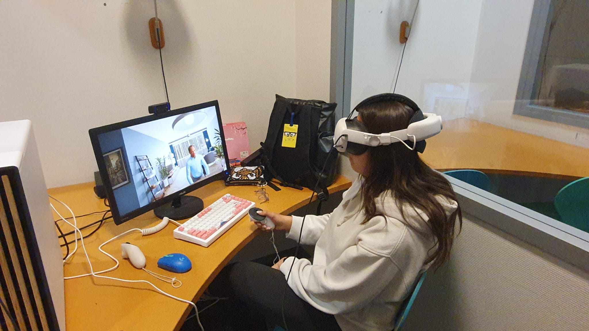

# Weekly Progress Journal (6th October to 29th October) - Testing 

This section is very self-explanatory. Over the course of three to four weeks, I had the opportunity to test my project with various individuals (10 in total), ranging in age and beliefs. However, most (9 out of 10) were French, which meant I was only able to test the English version once. Moreover, it means I didn't get the variety in background and language that I was aiming for. However, I was still a fairly decent sample, considering the differences in age groups, experience with technology and personal views and approaches to discussing the topic. Overall, I'm very content with the participants I was able to find.

### French-speaking participants

### English-speaking participants

### Pictures

  
  
  
  
  
  
  
  
  
  

